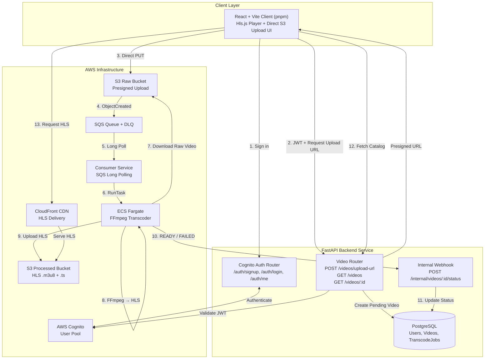

# Distributed Cloud Video Transcoder & Adaptive Bitrate (ABR) Streaming Platform

[](https://fastapi.tiangolo.com)
[](https://aws.amazon.com/fargate/)
[](https://www.terraform.io/)
[](https://ffmpeg.org/)
[](https://react.dev/)

An event-driven, production-grade cloud-native video transcoding platform that converts high-resolution raw uploads into multi-bitrate **HLS (HTTP Live Streaming)** packages (1080p, 720p, 360p). Features direct-to-S3 presigned ingestion, asynchronous SQS queueing, serverless AWS ECS Fargate FFmpeg workers, webhooks, modular Terraform (HCL) infrastructure, and a modern React streaming client.

---

## Architecture Blueprint



---

## Key System Features & Engineering Decisions

### 1. Direct-to-S3 Uploads via Presigned URLs
- **Problem**: Uploading multi-gigabyte video files directly through an application server creates memory pressure, starves HTTP thread pools, and limits concurrent user capacity.
- **Solution**: The backend signs an Amazon S3 `PUT` Presigned URL with a 60-minute expiration. The browser streams the video directly to S3 with live upload progress tracking, keeping backend servers lightweight and horizontally scalable.

### 2. Decoupled Asynchronous Transcoding (S3 &rarr; SQS &rarr; ECS Fargate)
- **Problem**: Video transcoding is compute-heavy and variable in duration (taking anywhere from seconds to tens of minutes). Monolithic or synchronous architectures suffer catastrophic cascade failures under traffic spikes.
- **Solution**: S3 emits `s3:ObjectCreated:*` notifications to an Amazon SQS queue. A dedicated consumer daemon polls SQS and triggers containerized **AWS ECS Fargate** tasks on-demand. When no videos are pending, computing resources scale to zero.

### 3. Adaptive Bitrate Streaming (ABR) with Synchronized GOP
- Generates 3 HLS quality renditions using FFmpeg:
  - **1080p (Full HD)**: 1920x1080 @ 8000 kbps (High profile, Level 4.1)
  - **720p (HD)**: 1280x720 @ 4000 kbps (High profile, Level 4.1)
  - **360p (Mobile)**: 640x360 @ 1000 kbps (Main profile)
- Synchronized closed GOP (`-g 48 -keyint_min 48 -sc_threshold 0`) ensures identical keyframe intervals across all renditions, enabling client video players to smoothly shift bitrates mid-playback without audio/video buffering or stuttering.
- Generates multi-variant `master.m3u8` playlist and independent 6-second MPEG-TS segments (`segment_%03d.ts`).

### 4. Resilient Error Handling & Dead Letter Queue (DLQ)
- SQS is configured with a Dead Letter Queue (`maxReceiveCount = 3`). Poisonous, corrupted, or unsupported media files are safely moved to the DLQ after 3 failed processing attempts without blocking the pipeline.
- Transcoder captures execution errors and notifies the backend webhook with `status="FAILED"` and error diagnostics.

### 5. Production Infrastructure as Code (Terraform / HCL)
- 100% modular AWS infrastructure defined in `terraform/`:
  - **Networking**: VPC, Public Subnets in 2 AZs, Route Tables, Internet Gateway, and ECS Security Groups.
  - **Storage**: Raw S3 bucket with CORS and SQS event notification; Processed S3 bucket with CloudFront Origin Access Control (OAC).
  - **Queueing**: SQS Queue + DLQ with Redrive policy and S3 publish permission.
  - **Compute**: ECR Repositories, ECS Fargate Cluster, Task Definitions, and least-privilege IAM Roles.
  - **Identity**: AWS Cognito User Pool with email sign-up and App Client.
  - **CDN**: Amazon CloudFront distribution with gzip/brotli compression and optimized caching headers (`no-cache` for `.m3u8`, `max-age=31536000` for `.ts` segments).

---

## Project Structure

```
video-transcoder/
├── architecture.md           # Deep-dive architecture and design documentation
├── compose.yml               # Root Docker Compose for full local orchestration
├── backend/                  # FastAPI Application
│   ├── db/                   # SQLAlchemy PostgreSQL models (User, Video)
│   ├── routes/               # API Routers (auth, videos, internal webhook)
│   ├── middleware/           # Cognito auth & session middlewares
│   ├── helper/               # S3 presigned URL generator & auth helpers
│   └── main.py               # FastAPI entry point & lifespan handler
├── transcoder/               # Worker Container (FFmpeg ABR Worker)
│   ├── main.py               # Downloader, multi-variant FFmpeg ABR, S3 uploader & webhook
│   └── Dockerfile            # Container image with Python 3.11 + FFmpeg
├── consumer/                 # SQS Polling Daemon
│   ├── main.py               # Long-polls SQS & dispatches ECS Fargate tasks
│   └── Dockerfile            # Consumer container build
├── frontend/                 # React 19 + Vite Web Application (pnpm)
│   ├── src/components/       # VideoPlayer (Hls.js + quality switcher), VideoGrid, UploadModal, Navbar
│   ├── src/api/client.ts     # S3 presigned upload & video directory client
│   └── src/App.css           # Premium dark theme design system
└── terraform/                # Infrastructure as Code (HCL)
    ├── main.tf               # Root module orchestration
    ├── variables.tf          # Parameterized inputs
    ├── outputs.tf            # Exported infrastructure endpoints
    └── modules/              # networking, storage, queue, compute, cognito, cdn
```

---

## Quickstart & Local Demonstration

### 1. Run Backend Services (Docker Compose)
Launch the PostgreSQL database, FastAPI backend, and consumer daemon locally:
```bash
docker compose up -d
```
The FastAPI backend will be live at `http://localhost:8000` with interactive Swagger docs at `http://localhost:8000/docs`.

### 2. Run the React Streaming Client
Install dependencies and launch the Vite dev server with **pnpm**:
```bash
cd frontend
pnpm install
pnpm dev
```
Open `http://localhost:5173` in your browser.
- Watch the built-in Adaptive Bitrate HLS test stream.
- Test manual quality switching between **1080p**, **720p**, and **360p**.
- Click **Upload Video** to test the direct S3 presigned upload pipeline with live progress bars.

---

## AWS Cloud Deployment (Terraform)

### Prerequisites
- AWS CLI configured (`aws configure`)
- Terraform 1.5+ installed

### Steps
1. Navigate to the terraform directory:
   ```bash
   cd terraform
   cp terraform.tfvars.example terraform.tfvars
   ```
2. Initialize and deploy:
   ```bash
   terraform init
   terraform plan
   terraform apply -auto-approve
   ```
3. Build and push container images to Amazon ECR:
   ```bash
   # Log in to ECR
   aws ecr get-login-password --region us-east-1 | docker login --username AWS --password-stdin <ECR_URL>

   # Build & push transcoder
   docker build -t <TRANSCODER_ECR_URL>:latest ./transcoder
   docker push <TRANSCODER_ECR_URL>:latest

   # Build & push consumer
   docker build -t <CONSUMER_ECR_URL>:latest ./consumer
   docker push <CONSUMER_ECR_URL>:latest
   ```

---
